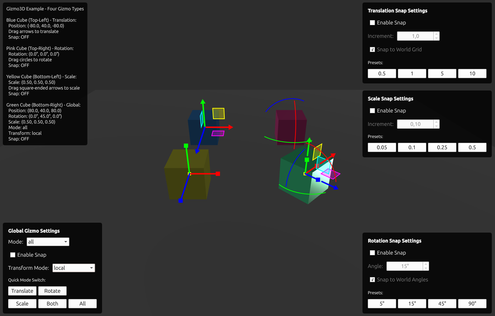

# Gizmo3D - Qt Quick 3D Transformation Gizmos

A pure QML library providing interactive 3D transformation gizmos for Qt Quick 3D applications. Manipulate 3D objects with translation, rotation, and scale handles using Canvas-based 2D rendering and View3D coordinate mapping.



## Features

- **TranslationGizmo**: Axis-constrained arrows and planar handles for 3D movement
- **RotationGizmo**: Circular handles for axis-constrained rotation with angle visualization
- **ScaleGizmo**: Square handles for axis-constrained and uniform scaling
- **GlobalGizmo**: Combined interface with mode switching (translate/rotate/scale/all)
- **World/Local Modes**: Transform relative to world axes or object's local orientation
- **Grid Snapping**: Configurable snap increments for translation, rotation, and scale
- **Signal-Based Architecture**: Decoupled manipulation for easy integration with external frameworks
- **Pure QML**: No C++ dependencies, maximum portability

## Quick Start

```qml
import QtQuick
import QtQuick3D
import Gizmo3D 1.0

View3D {
    id: view3d

    Model {
        id: myCube
        source: "#Cube"
    }

    PerspectiveCamera { id: camera }
}

TranslationGizmo {
    view3d: view3d
    targetNode: myCube

    property vector3d dragStartPos

    onAxisTranslationStarted: dragStartPos = myCube.position
    onAxisTranslationDelta: (axis, mode, delta, snap) => {
        var pos = dragStartPos
        if (axis === 1) pos.x += delta
        else if (axis === 2) pos.y += delta
        else if (axis === 3) pos.z += delta
        myCube.position = pos
    }
}
```

## Build Requirements

- CMake 3.21+
- Qt 6 (Core, Gui, Qml, Quick, Quick3D, Test)
- Ninja build system
- C++20 compiler

## Building

### Using CMake Presets (Recommended)

```bash
# Complete workflow (configure + build + test)
cmake --workflow --preset debug

# Individual steps
cmake --preset debug              # Configure
cmake --build --preset debug      # Build
ctest --preset debug              # Test
```

### Available Presets

- `debug` - Debug build with full symbols
- `release` - Release build with optimizations
- `relwithdebinfo` - Release with debug symbols

### Traditional CMake

```bash
cmake -B build -DCMAKE_BUILD_TYPE=Debug -G Ninja
cmake --build build
ctest --test-dir build
```

## Running the Example

```bash
# Direct execution
./build/debug/examples/gizmo3d_example
```

## Integration

### CMake

```cmake
# Add Gizmo3D as subdirectory
add_subdirectory(path/to/gizmo-3d)

# Link to your target
target_link_libraries(your_app PRIVATE gizmo3d)
```

### QML Import

```qml
import Gizmo3D 1.0

TranslationGizmo { /* ... */ }
RotationGizmo { /* ... */ }
ScaleGizmo { /* ... */ }
GlobalGizmo { /* ... */ }
```

## Signal-Based Architecture

All gizmos emit signals instead of directly manipulating the target node. This enables:

- **Framework Integration**: Works with external scene managers
- **Validation**: Controllers can validate/constrain transformations
- **Undo/Redo**: Delta-from-start pattern supports command history
- **Multi-Object**: Apply deltas to multiple selected objects

### Signal Patterns

| Gizmo | Signals |
|-------|---------|
| TranslationGizmo | `axisTranslationStarted/Delta/Ended`, `planeTranslationStarted/Delta/Ended` |
| RotationGizmo | `rotationStarted/Delta/Ended` |
| ScaleGizmo | `scaleStarted/Delta/Ended` |
| GlobalGizmo | Forwards all signals from child gizmos |

## Documentation

- [Quick Start Guide](doc/getting-started/quick-start.md) - 5-minute integration tutorial
- [API Reference](doc/api-reference/) - Complete API documentation
- [Architecture Overview](doc/architecture/overview.md) - Design and implementation
- [Controller Pattern](doc/user-guide/controller-pattern.md) - Signal handling patterns
- [Troubleshooting](doc/troubleshooting/common-issues.md) - Common issues and solutions

## License

MIT License - See LICENSE file for details.
