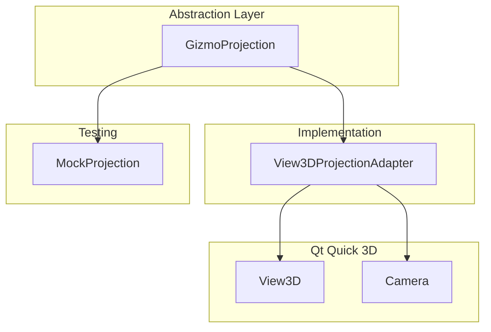
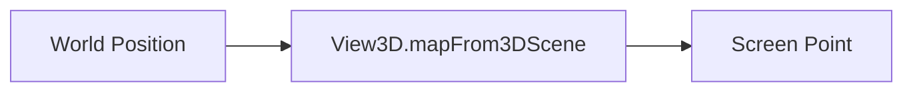
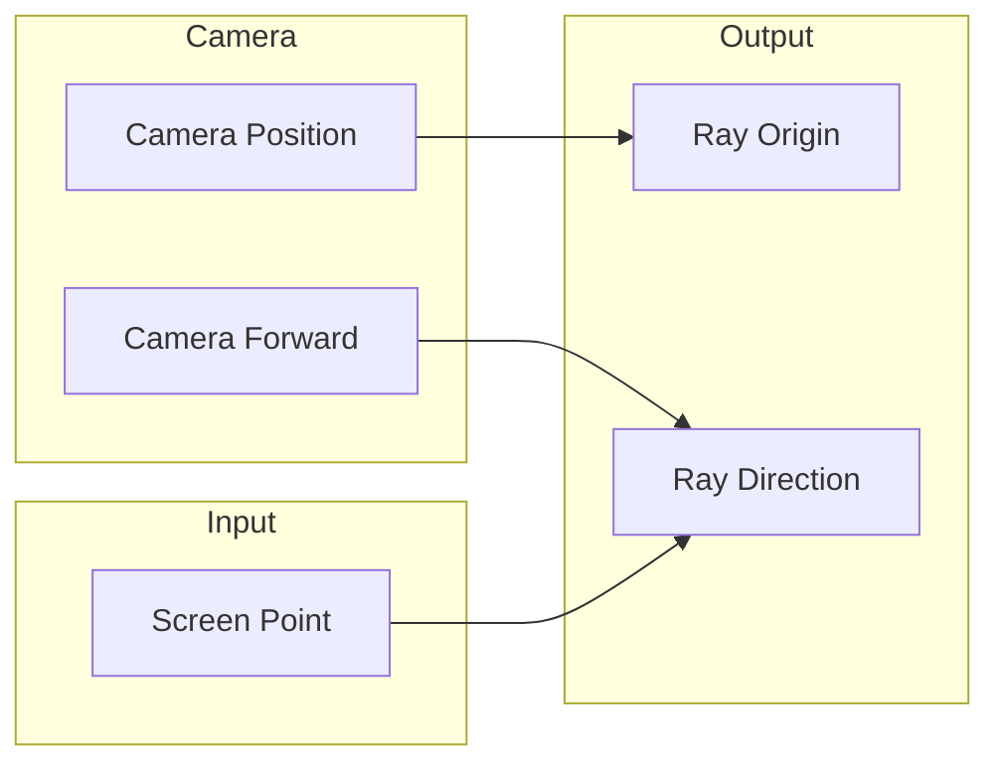
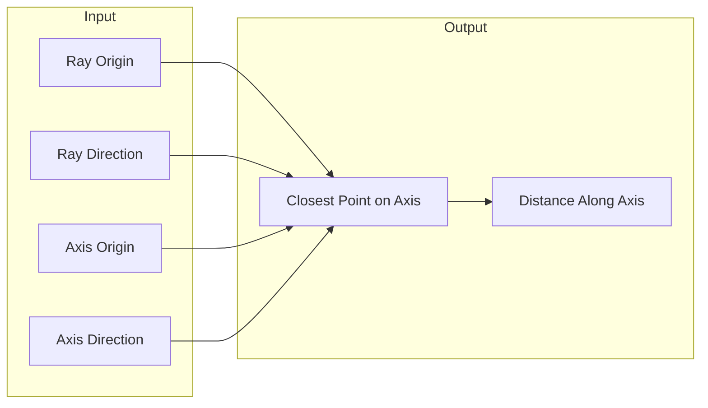

# Coordinate Mapping

World/screen space conversions and camera ray construction in Gizmo3D.

## Coordinate Systems

### Qt Quick 3D World Space

Right-handed coordinate system:

```
       Y (up)
       │
       │
       │
       └───── X (right)
      /
     /
    Z (toward camera)
```

- **Origin**: Scene origin (0, 0, 0)
- **Units**: Scene units (typically 1 unit = 1 meter)
- **Handedness**: Right-handed

### Screen Space

Qt Quick window coordinates:

```
(0,0)─────────────► X
  │
  │
  │
  ▼
  Y
```

- **Origin**: Top-left corner
- **Units**: Pixels
- **Y-axis**: Inverted (positive down)

## Projection Architecture



The projection abstraction allows gizmo components to work with either real View3D or mock projectors for testing.

## World to Screen

Convert a 3D world position to 2D screen coordinates.

### API

```qml
// Using GizmoMath singleton
var screenPoint = GizmoMath.worldToScreen(view3d, worldPosition)

// Using projection adapter
var projector = View3DProjectionAdapter.createProjector(view3d)
var screenPoint = projector.projectWorldToScreen(worldPosition)
```

### Implementation



Internally uses Qt Quick 3D's `mapFrom3DScene()`:

```javascript
function worldToScreen(view3d, worldPos) {
    if (!view3d || !view3d.camera) return null
    return view3d.mapFrom3DScene(worldPos)
}
```

### Behavior

- Returns `Qt.point(x, y)` in window coordinates
- Points behind the camera may return invalid coordinates
- Handles perspective projection automatically

## Screen to World

Convert a 2D screen position to a 3D ray or point on a plane.

### Camera Ray Construction



### API

```qml
// Get camera ray from screen point
var ray = GizmoMath.getCameraRay(view3d, screenPoint)
// ray.origin: camera position
// ray.direction: normalized direction toward screen point
```

### Implementation

```javascript
function getCameraRay(view3d, screenPos) {
    var camera = view3d.camera
    var origin = camera.scenePosition

    // Get a world point on the screen plane
    var worldPoint = view3d.mapTo3DScene(screenPos)

    // Calculate direction from camera to that point
    var direction = normalize(subtract(worldPoint, origin))

    return { origin: origin, direction: direction }
}
```

## Ray Intersections

### Ray-Axis Intersection

Find the closest point on an axis line to a ray.



### API

```qml
var result = GizmoMath.closestPointOnAxisToRay(
    rayOrigin,      // camera position
    rayDirection,   // normalized ray direction
    axisOrigin,     // gizmo center
    axisDirection   // normalized axis direction
)
// result.point: closest point on axis
// result.t: parameter along axis (0 = origin, 1 = origin + direction)
```

### Ray-Plane Intersection

Find where a ray intersects a plane.

```qml
var intersection = GizmoMath.intersectRayPlane(
    rayOrigin,
    rayDirection,
    planeOrigin,
    planeNormal
)
// Returns vector3d intersection point, or null if parallel
```

## Local vs World Axes

### World Mode

Axes aligned with global coordinate system:

```qml
var worldAxes = {
    x: Qt.vector3d(1, 0, 0),
    y: Qt.vector3d(0, 1, 0),
    z: Qt.vector3d(0, 0, 1)
}
```

### Local Mode

Axes derived from target node's rotation:

```qml
var localAxes = GizmoMath.getLocalAxes(targetNode.rotation)
// localAxes.x: object's local X axis in world space
// localAxes.y: object's local Y axis in world space
// localAxes.z: object's local Z axis in world space
```

### Implementation

```javascript
function getLocalAxes(rotation) {
    // Extract axes from quaternion
    var qx = rotation.x, qy = rotation.y, qz = rotation.z, qw = rotation.scalar

    return {
        x: Qt.vector3d(
            1 - 2*(qy*qy + qz*qz),
            2*(qx*qy + qw*qz),
            2*(qx*qz - qw*qy)
        ),
        y: Qt.vector3d(
            2*(qx*qy - qw*qz),
            1 - 2*(qx*qx + qz*qz),
            2*(qy*qz + qw*qx)
        ),
        z: Qt.vector3d(
            2*(qx*qz + qw*qy),
            2*(qy*qz - qw*qx),
            1 - 2*(qx*qx + qy*qy)
        )
    }
}
```

## Angle Calculations

### Plane Angle

Calculate the angle of a point projected onto a plane:

```qml
var angle = GizmoMath.calculatePlaneAngle(
    point,          // 3D point
    center,         // plane center
    planeNormal,    // plane normal
    referenceAxis   // 0° reference direction
)
// Returns angle in radians
```

### Rotation Delta

Normalize angle delta to avoid discontinuities:

```qml
var normalizedDelta = GizmoMath.normalizeAngleDelta(delta)
// Normalizes to [-π, π] range
```

## Projection Adapter Interface

The `View3DProjectionAdapter` creates a projector object with these methods:

```qml
var projector = View3DProjectionAdapter.createProjector(view3d)

// Available methods:
projector.projectWorldToScreen(worldPos)  // vector3d → point
projector.projectScreenToWorld(screenPos) // point → vector3d
projector.getCameraRay(screenPos)         // point → {origin, direction}
projector.getCameraPosition()             // → vector3d
projector.getCameraForward()              // → vector3d
```

### Mock Projection for Testing

For unit tests without a real View3D:

```qml
var mockProjector = MockProjection.createProjector({
    cameraPosition: Qt.vector3d(0, 0, 10),
    cameraForward: Qt.vector3d(0, 0, -1),
    // Custom projection functions...
})
```

## Common Patterns

### Project Arrow Endpoints

```javascript
function calculateArrowGeometry(params) {
    var center = params.projector.projectWorldToScreen(params.targetPosition)

    // Calculate world-space axis endpoints
    var xEndWorld = vectorAdd(params.targetPosition,
                              vectorScale(params.axes.x, params.gizmoSize))

    // Project to screen
    var xEnd = params.projector.projectWorldToScreen(xEndWorld)

    return { center: center, xEnd: xEnd, /* ... */ }
}
```

### Calculate Translation Delta

```javascript
function calculateTranslationDelta(mouse, dragStartPos, axis) {
    var ray = GizmoMath.getCameraRay(view3d, mouse)
    var closest = GizmoMath.closestPointOnAxisToRay(
        ray.origin, ray.direction,
        dragStartPos, axis
    )
    return closest.t  // Distance along axis
}
```

## See Also

- [Architecture Overview](overview.md) - System architecture
- [Rendering Pipeline](rendering.md) - Canvas rendering details
- [GizmoMath API](../api-reference/gizmo-math.md) - Math utilities reference
