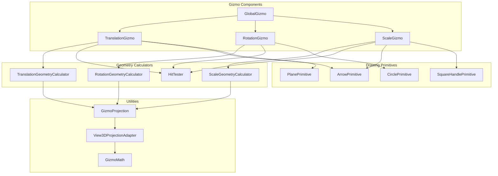
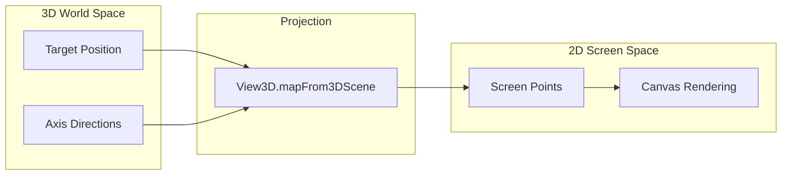
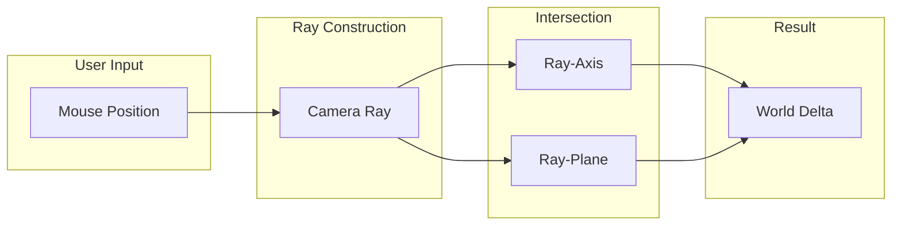
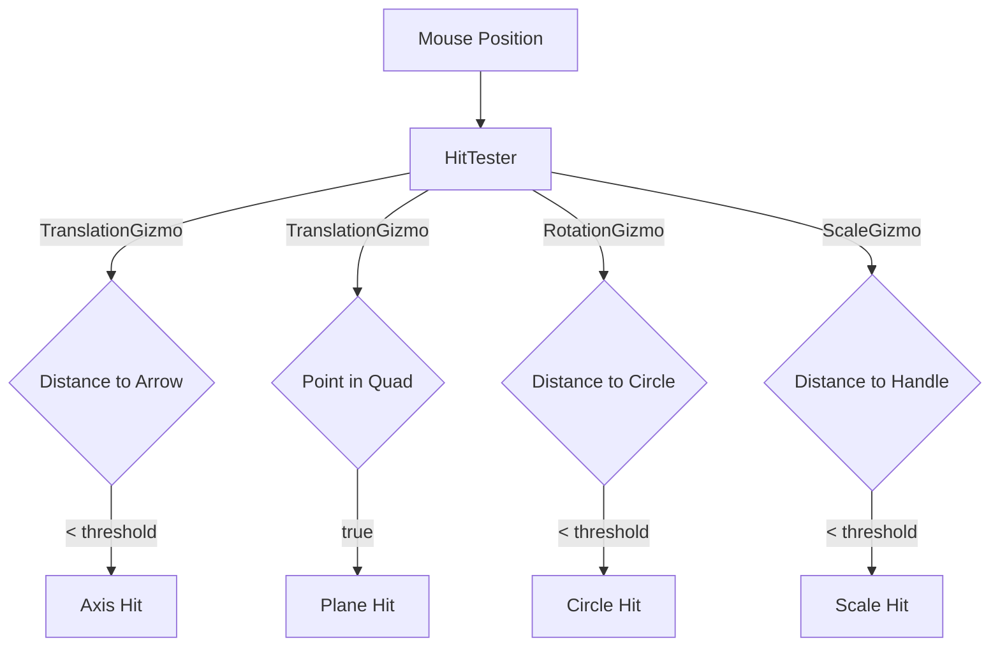
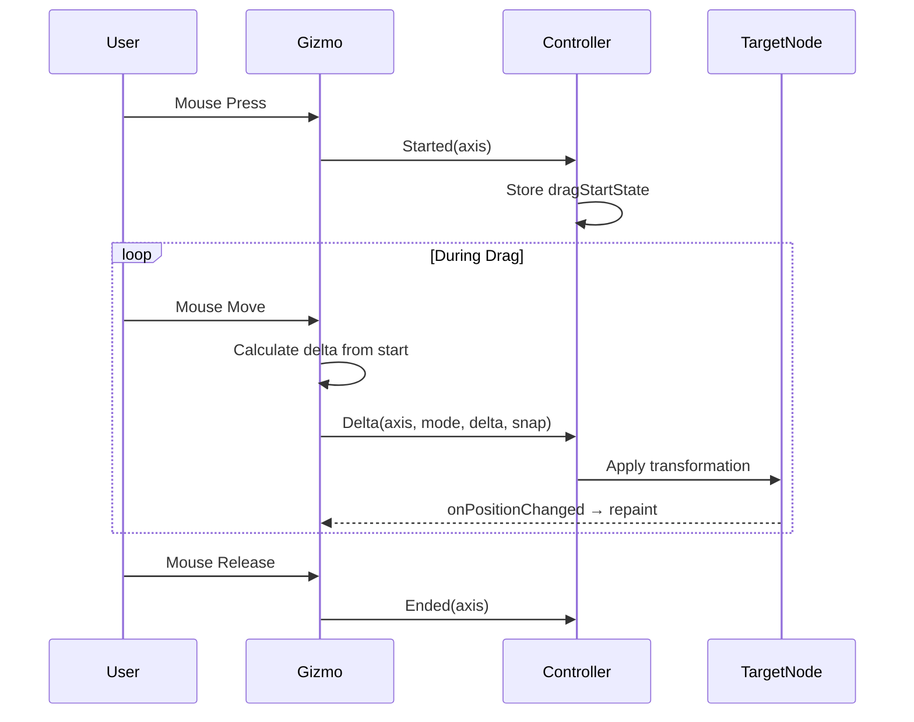

# Architecture Overview

System architecture, design goals, and technical decisions behind Gizmo3D.

## Design Goals

1. **2D/3D Hybrid Rendering**: Use Canvas 2D for gizmo rendering while performing 3D geometric calculations
2. **Signal-Based Manipulation**: Decouple gizmo UI from scene manipulation for framework integration
3. **Geometric Precision**: Use mathematical hit detection instead of pixel-based approaches
4. **Qt Quick 3D Integration**: Leverage View3D coordinate mapping for world/screen conversion
5. **Pure QML**: No C++ dependencies for maximum portability

## Component Architecture



### Component Layers

| Layer | Components | Purpose |
|-------|------------|---------|
| **Gizmos** | TranslationGizmo, RotationGizmo, ScaleGizmo, GlobalGizmo | User-facing manipulation handles |
| **Geometry** | TranslationGeometryCalculator, RotationGeometryCalculator, ScaleGeometryCalculator, HitTester | Pure calculations for positions and hit detection |
| **Drawing** | ArrowPrimitive, CirclePrimitive, PlanePrimitive, SquareHandlePrimitive | Stateless Canvas rendering |
| **Utilities** | GizmoMath, GizmoProjection, View3DProjectionAdapter | Math operations and coordinate mapping |

## Rendering Pipeline

### World to Screen Conversion



The gizmo calculates arrow/circle endpoints in 3D world space, then converts to screen space for rendering.

### Canvas Rendering Details

- **Type**: Threaded Canvas with FramebufferObject render target
- **Context**: 2D context with alpha blending
- **Primitives**: Lines, arcs, polygons drawn in screen space
- **Triggers**: Manual `requestPaint()` calls on state changes

### Screen to World Interaction



Mouse interactions use camera rays to perform 3D picking and calculate transformation deltas.

## Coordinate System

Qt Quick 3D uses a right-handed coordinate system:

```
    Y (green, up)
    |
    |__ X (red, right)
   /
  Z (blue, toward camera)
```

## Hit Detection Strategy

### Geometric Approach

Uses mathematical distance calculations in screen space:



**Algorithms Used**:
- **Axes**: `distanceToLineSegment2D(mouse, lineStart, lineEnd) < threshold`
- **Planes**: `pointInQuad2D(mouse, quadCorners)`
- **Circles**: `distanceToPolyline2D(mouse, circlePoints) < threshold`
- **Squares**: Point-in-rectangle test

**Advantages**:
- Precise and predictable
- No hidden canvas overhead
- Easier to debug and modify
- Consistent across platforms

## Signal Pattern Design

### Problem: Tight Coupling

Direct manipulation couples gizmo UI to scene management:

```qml
// Tight coupling - avoid this pattern
onMouseMoved: {
    targetNode.position.x += delta
}
```

### Solution: Signal-Based Decoupling

Gizmos emit transformation deltas as signals:



**Benefits**:
- Framework integration (external scene managers)
- Validation and constraints at controller level
- Undo/redo support (delta from known start state)
- Multi-object manipulation
- Gizmo simplicity

## Static QML Module System

### Build Structure

```cmake
qt_add_qml_module(gizmo3d
    URI Gizmo3D
    VERSION 0.1
    STATIC
    NO_PLUGIN
    QML_FILES
        TranslationGizmo.qml
        RotationGizmo.qml
        ScaleGizmo.qml
        GlobalGizmo.qml
        GizmoMath.qml
        # ... more files
)
```

Creates a static backing library `gizmo3d` for linking.

### QML Module Discovery

```cmake
set(QML_IMPORT_PATH "${CMAKE_BINARY_DIR}/src" CACHE STRING "" FORCE)
```

Or at runtime:
```cpp
engine.addImportPath("path/to/gizmo3d/build/src");
```

## Performance Characteristics

### Rendering Performance

| Operation | Complexity | Notes |
|-----------|------------|-------|
| Axis/Plane calculations | O(1) | Simple vector math |
| Circle rendering | O(n) | n=64 segments default |
| Hit detection | O(1) per gizmo | Distance calculations |
| Canvas repaints | ~60 FPS during drag | Manual triggering |

### Memory Footprint

- **Per Gizmo**: ~2-5 MB (Canvas framebuffer)
- **Shared Singletons**: GizmoMath, calculators (minimal)
- **No Texture Assets**: All rendering procedural

### Scalability

- **Multiple Gizmos**: Each independent, no shared mutable state
- **Large Scenes**: Gizmo performance independent of scene complexity
- **High DPI**: Automatic scaling via View3D coordinate mapping

## Design Trade-offs

### Canvas 2D vs 3D Rendering

**Chosen: Canvas 2D**
- Constant screen-space size
- Simple alpha blending
- No shader complexity
- Manual perspective handling for circles (trade-off)

### Geometric vs Pixel-Based Hit Detection

**Chosen: Geometric**
- Precise and predictable
- No rendering overhead
- Easy debugging
- More complex math (acceptable trade-off)

### Signal Pattern vs Direct Manipulation

**Chosen: Signal Pattern**
- Framework integration
- Validation support
- Undo/redo ready
- Requires controller component (minor overhead)

## See Also

- [Rendering Pipeline](rendering.md) - Canvas rendering technical details
- [Coordinate Mapping](coordinate-mapping.md) - World/screen space conversions
- [Signal Pattern](signal-pattern.md) - Manipulation pattern rationale
