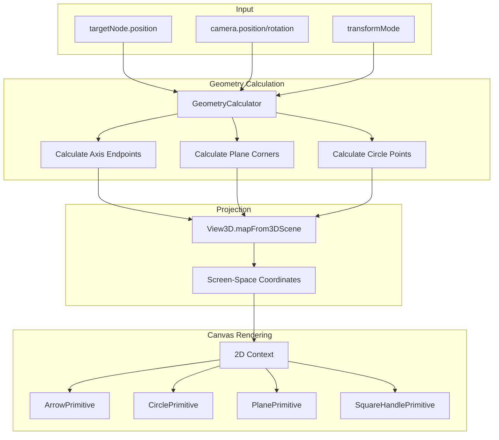
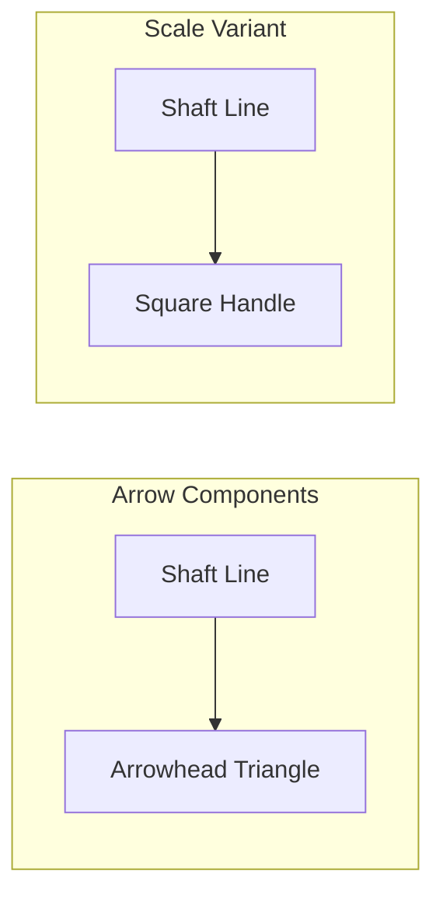
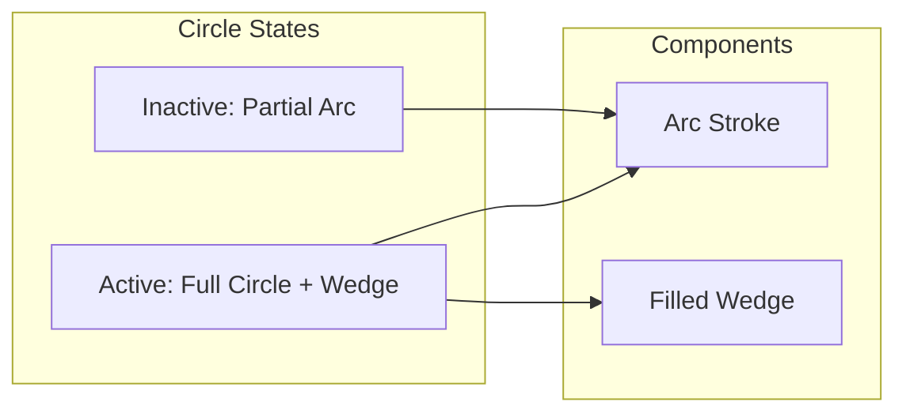

# Rendering Pipeline

Technical details of Gizmo3D's Canvas 2D/3D hybrid rendering approach.

## Overview

Gizmo3D renders 3D manipulation handles using Qt's Canvas 2D element. This approach provides:

- Constant screen-space size regardless of camera distance
- Simple anti-aliased rendering
- No Z-fighting with scene geometry
- Efficient hit detection without GPU readback

## Rendering Flow



## Canvas Configuration

Each gizmo uses a Canvas element configured for optimal performance:

```qml
Canvas {
    id: canvas
    anchors.fill: parent
    renderStrategy: Canvas.Threaded      // Off-main-thread rendering
    renderTarget: Canvas.FramebufferObject  // GPU-accelerated

    onPaint: {
        var ctx = getContext("2d", { alpha: true })
        // ... rendering code
    }
}
```

### Render Strategy

| Strategy | Description | Use Case |
|----------|-------------|----------|
| `Canvas.Immediate` | Main thread, immediate | Debugging |
| `Canvas.Threaded` | Worker thread, batched | **Production** |
| `Canvas.Cooperative` | Main thread, yielding | Legacy |

### Render Target

| Target | Description | Use Case |
|--------|-------------|----------|
| `Canvas.Image` | CPU-side QImage | Static content |
| `Canvas.FramebufferObject` | GPU FBO | **Interactive** |

## Drawing Primitives

### ArrowPrimitive

Renders directional arrows for translation and scale gizmos.



**Methods:**
- `draw(ctx, start, end, color, lineWidth)` - Arrow with triangular head
- `drawWithSquare(ctx, start, end, color, lineWidth, squareSize)` - Arrow with square end

**Properties:**
- `headLength`: 15px - Arrowhead size
- `headAngle`: 30° - Arrowhead opening angle
- `lineCap`: "round" - Line end style

### CirclePrimitive

Renders rotation circles with perspective-correct projection.



**Methods:**
- `drawCircle(ctx, points, color, lineWidth)` - Simple circle outline
- `drawArc(ctx, points, arcCenter, arcRange, color, lineWidth)` - Partial arc
- `draw(ctx, points, center, color, lineWidth, filled, startAngle, endAngle, ...)` - Full with optional wedge

**Properties:**
- `fillAlpha`: 0.5 - Wedge fill transparency
- `lineCap`: "round" - Line end style
- `lineJoin`: "round" - Corner style

### PlanePrimitive

Renders translucent quads for planar translation.

**Methods:**
- `draw(ctx, corners, color, active)` - Filled quad with outline

**Properties:**
- `inactiveAlpha`: 0.3 - Fill transparency when not hovered
- `activeAlpha`: 0.5 - Fill transparency when active
- `inactiveLineWidth`: 2 - Outline width when not hovered
- `activeLineWidth`: 3 - Outline width when active

### SquareHandlePrimitive

Renders square handles for scale gizmo endpoints.

**Methods:**
- `draw(ctx, center, color, customSize)` - Centered square

**Properties:**
- `defaultSize`: 12 - Handle size in pixels
- `lineWidth`: 1 - Outline width

## Repaint Triggers

Gizmos use manual repaint triggering via `canvas.requestPaint()` for performance. Repaints occur on:

### State Changes
- `targetNode.position` changed
- `targetNode.rotation` changed (local mode)
- `targetNode.scale` changed
- `activeAxis` changed (mouse press/release)

### Camera Changes
- `camera.position` changed
- `camera.rotation` changed

### User Interaction
- Mouse drag (continuous during interaction)

### Implementation

```qml
Connections {
    target: root.targetNode
    function onPositionChanged() {
        canvas.requestPaint()
    }
}

Connections {
    target: root.view3d ? root.view3d.camera : null
    function onPositionChanged() {
        canvas.requestPaint()
    }
    function onRotationChanged() {
        canvas.requestPaint()
    }
}
```

## Geometry Calculators

Pure functions that compute screen-space geometry from 3D inputs.

### TranslationGeometryCalculator

```qml
calculateArrowGeometry({
    projector,        // View3DProjectionAdapter
    targetPosition,   // vector3d
    axes,            // {x, y, z} vectors
    gizmoSize,       // real
    maxScreenSize,   // real
    arrowStartRatio, // real
    arrowEndRatio    // real
})
```

**Returns:**
```javascript
{
    center: Qt.point(x, y),
    xStart: Qt.point(x, y), xEnd: Qt.point(x, y),
    yStart: Qt.point(x, y), yEnd: Qt.point(x, y),
    zStart: Qt.point(x, y), zEnd: Qt.point(x, y),
    xyPlane: [p1, p2, p3, p4],  // Quad corners
    xzPlane: [p1, p2, p3, p4],
    yzPlane: [p1, p2, p3, p4]
}
```

### RotationGeometryCalculator

```qml
calculateCircleGeometry({
    projector,
    targetPosition,
    axes,
    gizmoSize,
    maxScreenRadius,
    segments        // Number of circle points (default: 64)
})
```

**Returns:**
```javascript
{
    center: Qt.point(x, y),
    xyCircle: [p1, p2, ...],  // Polyline points
    yzCircle: [p1, p2, ...],
    zxCircle: [p1, p2, ...]
}
```

### ScaleGeometryCalculator

Same interface as TranslationGeometryCalculator, returns arrow endpoints for scale handles.

## Screen-Space Clamping

To prevent oversized gizmos when the camera is close to the target, geometry calculators implement screen-space clamping:

```javascript
// Calculate actual screen distance
var screenDistance = distance(center, axisEnd)

// Clamp to maximum
if (screenDistance > maxScreenSize) {
    var scale = maxScreenSize / screenDistance
    axisEnd = lerp(center, axisEnd, scale)
}
```

## Performance Considerations

### Memory

- Each Canvas allocates a framebuffer (~2-5 MB depending on size)
- Singletons (GizmoMath, calculators) have minimal footprint
- No texture assets - all rendering is procedural

### CPU

- Geometry calculations are O(1) for axes/planes
- Circle calculations are O(n) where n = segment count (64 default)
- Hit detection is O(1) per gizmo component

### GPU

- Canvas.Threaded offloads rendering to worker thread
- FramebufferObject enables GPU-accelerated compositing
- No shaders - uses 2D drawing primitives

### Optimization Tips

1. **Reduce circle segments** for rotation gizmo if performance is critical
2. **Disable local mode connections** when using world-only transforms
3. **Batch repaints** - the Canvas already batches within a frame
4. **Avoid unnecessary gizmos** - only show active manipulation mode

## See Also

- [Architecture Overview](overview.md) - System architecture
- [Coordinate Mapping](coordinate-mapping.md) - World/screen space conversions
