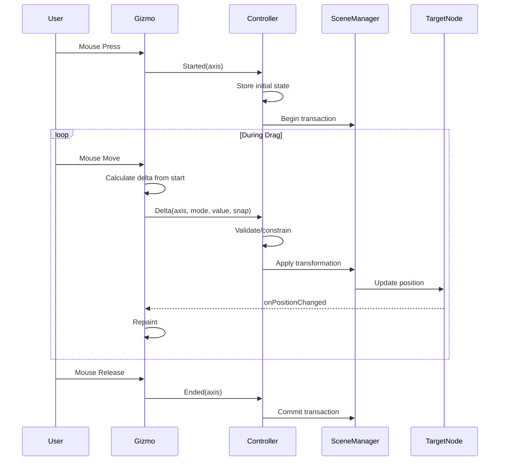

# Signal-Based Manipulation Pattern

Design rationale and implementation details for Gizmo3D's signal-based architecture.

## The Problem

Traditional gizmo implementations directly modify the target object:

```qml
// Direct manipulation - problematic pattern
MouseArea {
    onPositionChanged: {
        targetNode.position.x += mouse.x - lastMouse.x
    }
}
```

This creates several issues:

### Tight Coupling

The gizmo component becomes responsible for:
- Understanding how to modify the target
- Handling coordinate space conversions
- Applying constraints and validation
- Managing undo/redo state

### Framework Integration

External scene managers (game engines, CAD systems) often:
- Use their own transformation representation
- Require change notification through specific APIs
- Need to validate transformations before applying
- Must maintain consistency with physics systems

### Multi-Object Selection

Direct manipulation doesn't naturally extend to:
- Multiple selected objects
- Relative vs absolute transforms
- Pivot point handling

## The Solution: Delta Signals

Gizmos emit transformation *deltas* as signals, leaving application to the controller.



## Signal Signatures

All gizmos follow the **Started/Delta/Ended** pattern:

### TranslationGizmo

```qml
// Axis translation (constrained to single axis)
signal axisTranslationStarted(int axis)
signal axisTranslationDelta(int axis, string transformMode, real delta, bool snapActive)
signal axisTranslationEnded(int axis)

// Planar translation (constrained to plane)
signal planeTranslationStarted(int plane)
signal planeTranslationDelta(int plane, string transformMode, vector3d delta, bool snapActive)
signal planeTranslationEnded(int plane)
```

### RotationGizmo

```qml
signal rotationStarted(int axis)
signal rotationDelta(int axis, string transformMode, real angleDegrees, bool snapActive)
signal rotationEnded(int axis)
```

### ScaleGizmo

```qml
signal scaleStarted(int axis)
signal scaleDelta(int axis, string transformMode, real scaleFactor, bool snapActive)
signal scaleEnded(int axis)
```

## Delta Semantics

### Key Principle: Delta from Start

All delta signals report the **total change since drag started**, not incremental frame-to-frame deltas.

```javascript
// Inside gizmo onPositionChanged:
var currentPosition = calculateWorldPosition(mouse)
var delta = currentPosition - dragStartPosition  // Always from start
emit axisTranslationDelta(axis, mode, delta.x, snapActive)
```

### Why Delta from Start?

1. **Numeric Stability**: Avoids accumulation of floating-point errors
2. **Undo/Redo**: Controller knows exact transformation to apply or revert
3. **Snapping**: Works correctly with absolute grid snapping
4. **Constraints**: Controller can clamp without drift

### Controller Implementation

```qml
TranslationGizmo {
    property vector3d dragStartPos

    onAxisTranslationStarted: function(axis) {
        dragStartPos = targetNode.position
    }

    onAxisTranslationDelta: function(axis, mode, delta, snap) {
        // Apply delta to start position (not current position)
        var newPos = dragStartPos
        if (axis === 1) newPos.x += delta
        else if (axis === 2) newPos.y += delta
        else if (axis === 3) newPos.z += delta

        targetNode.position = newPos
    }
}
```

## Axis/Plane Identifiers

### Axis Values

| Value | Axis | Color |
|-------|------|-------|
| 0 | None | - |
| 1 | X | Red |
| 2 | Y | Green |
| 3 | Z | Blue |
| 4 | Uniform (ScaleGizmo only) | Yellow |

### Plane Values

| Value | Plane | Color |
|-------|-------|-------|
| 0 | None | - |
| 1 | XY | Yellow |
| 2 | XZ | Magenta |
| 3 | YZ | Cyan |

## Transform Mode Parameter

Each delta signal includes `transformMode` indicating the coordinate system:

```qml
onAxisTranslationDelta: function(axis, transformMode, delta, snap) {
    if (transformMode === "world") {
        // Delta is in world coordinates
        targetNode.position.x += delta  // Direct application
    } else if (transformMode === "local") {
        // Delta is along object's local axis
        var localAxis = getLocalAxis(targetNode.rotation, axis)
        targetNode.position = targetNode.position.plus(localAxis.times(delta))
    }
}
```

## Controller Patterns

### Basic Controller

```qml
TranslationGizmo {
    id: gizmo
    view3d: myView3D
    targetNode: myCube

    property vector3d dragStartPos

    onAxisTranslationStarted: dragStartPos = myCube.position

    onAxisTranslationDelta: (axis, mode, delta, snap) => {
        var pos = dragStartPos
        if (axis === 1) pos.x += delta
        else if (axis === 2) pos.y += delta
        else if (axis === 3) pos.z += delta
        myCube.position = pos
    }
}
```

### Validated Controller

```qml
TranslationGizmo {
    property vector3d dragStartPos
    property rect bounds: Qt.rect(-100, -100, 200, 200)

    onAxisTranslationStarted: dragStartPos = targetNode.position

    onAxisTranslationDelta: (axis, mode, delta, snap) => {
        var pos = dragStartPos
        if (axis === 1) pos.x += delta
        else if (axis === 2) pos.y += delta
        else if (axis === 3) pos.z += delta

        // Constrain to bounds
        pos.x = Math.max(bounds.x, Math.min(bounds.x + bounds.width, pos.x))
        pos.y = Math.max(bounds.y, Math.min(bounds.y + bounds.height, pos.y))

        targetNode.position = pos
    }
}
```

### Multi-Object Controller

```qml
TranslationGizmo {
    property var selectedObjects: []
    property var dragStartPositions: []

    onAxisTranslationStarted: {
        dragStartPositions = selectedObjects.map(obj => obj.position)
    }

    onAxisTranslationDelta: (axis, mode, delta, snap) => {
        for (var i = 0; i < selectedObjects.length; i++) {
            var pos = dragStartPositions[i]
            if (axis === 1) pos.x += delta
            else if (axis === 2) pos.y += delta
            else if (axis === 3) pos.z += delta
            selectedObjects[i].position = pos
        }
    }
}
```

### Undo/Redo Controller

```qml
TranslationGizmo {
    property var undoStack: []
    property vector3d dragStartPos

    onAxisTranslationStarted: {
        dragStartPos = targetNode.position
    }

    onAxisTranslationEnded: function(axis) {
        // Record command for undo
        var finalPos = targetNode.position
        undoStack.push({
            type: "translate",
            target: targetNode,
            from: dragStartPos,
            to: finalPos
        })
    }

    function undo() {
        var cmd = undoStack.pop()
        if (cmd) cmd.target.position = cmd.from
    }
}
```

## Automatic Repaint

Gizmos automatically repaint when `targetNode.position` changes:

```qml
Connections {
    target: root.targetNode
    function onPositionChanged() {
        canvas.requestPaint()
    }
}
```

This creates a feedback loop:

1. Controller updates `targetNode.position`
2. Gizmo's Connection detects the change
3. Gizmo repaints to new position
4. Visual feedback is immediate

## Benefits Summary

| Benefit | Description |
|---------|-------------|
| **Decoupling** | Gizmo doesn't know how transformations are applied |
| **Validation** | Controller can validate/constrain before applying |
| **Framework Integration** | Works with any scene management system |
| **Multi-Object** | Controller can apply to multiple objects |
| **Undo/Redo** | Delta-from-start enables command pattern |
| **Testability** | Gizmo behavior testable without scene |

## See Also

- [Controller Pattern](../user-guide/controller-pattern.md) - User guide with examples
- [Architecture Overview](overview.md) - System architecture
- [API Reference](../api-reference/) - Signal signatures for each gizmo
