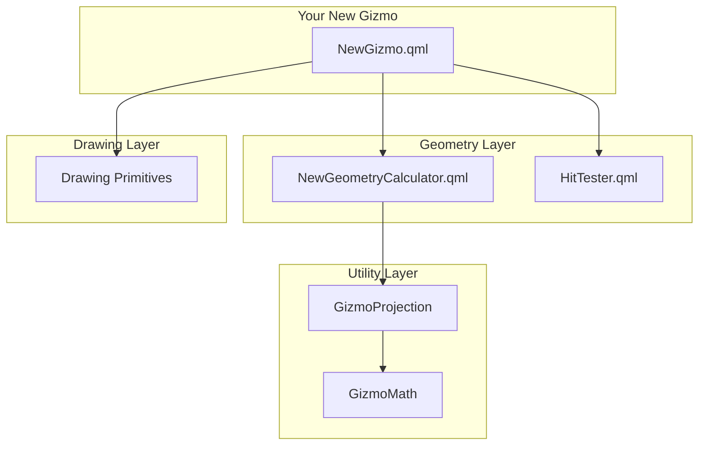

# Adding New Gizmo Types

Guide to creating custom gizmo components for Gizmo3D.

## Architecture Overview

Before creating a new gizmo, understand the component layers:



## Step 1: Define the Gizmo API

### Signals

Follow the Started/Delta/Ended pattern:

```qml
// Signals for manipulation
signal manipulationStarted(int axis)
signal manipulationDelta(int axis, string transformMode, real delta, bool snapActive)
signal manipulationEnded(int axis)
```

### Properties

Standard properties every gizmo should have:

```qml
// Required
property View3D view3d: null
property Node targetNode: null

// Size
property real gizmoSize: 100.0
property real maxScreenSize: 150.0

// Transform mode
property string transformMode: "world"  // or "local"

// Snap
property bool snapEnabled: false
property real snapIncrement: 1.0
property bool snapToAbsolute: true

// State (read-only)
readonly property int activeAxis: internal.activeAxis
readonly property bool isActive: activeAxis !== 0
```

## Step 2: Create the Geometry Calculator

Create `src/geometry/NewGeometryCalculator.qml`:

```qml
pragma Singleton
import QtQuick
import Gizmo3D

QtObject {
    /**
     * Calculate screen-space geometry for the gizmo.
     *
     * @param params Object with:
     *   - projector: View3DProjectionAdapter projector
     *   - targetPosition: vector3d world position
     *   - axes: {x, y, z} axis vectors
     *   - gizmoSize: real base size
     *   - maxScreenSize: real maximum extent
     * @returns Object with screen-space geometry
     */
    function calculateGeometry(params) {
        if (!params.projector) return null

        // Project center point
        var center = params.projector.projectWorldToScreen(params.targetPosition)
        if (!center) return null

        // Calculate axis endpoints in world space
        var xEndWorld = GizmoMath.vectorAdd(
            params.targetPosition,
            GizmoMath.vectorScale(params.axes.x, params.gizmoSize)
        )
        var yEndWorld = GizmoMath.vectorAdd(
            params.targetPosition,
            GizmoMath.vectorScale(params.axes.y, params.gizmoSize)
        )
        var zEndWorld = GizmoMath.vectorAdd(
            params.targetPosition,
            GizmoMath.vectorScale(params.axes.z, params.gizmoSize)
        )

        // Project to screen space
        var xEnd = params.projector.projectWorldToScreen(xEndWorld)
        var yEnd = params.projector.projectWorldToScreen(yEndWorld)
        var zEnd = params.projector.projectWorldToScreen(zEndWorld)

        // Apply screen-space clamping
        xEnd = clampToMaxSize(center, xEnd, params.maxScreenSize)
        yEnd = clampToMaxSize(center, yEnd, params.maxScreenSize)
        zEnd = clampToMaxSize(center, zEnd, params.maxScreenSize)

        return {
            center: center,
            xEnd: xEnd,
            yEnd: yEnd,
            zEnd: zEnd
        }
    }

    function clampToMaxSize(center, point, maxSize) {
        var dx = point.x - center.x
        var dy = point.y - center.y
        var dist = Math.sqrt(dx * dx + dy * dy)

        if (dist > maxSize) {
            var scale = maxSize / dist
            return Qt.point(
                center.x + dx * scale,
                center.y + dy * scale
            )
        }
        return point
    }
}
```

## Step 3: Add Hit Testing

Extend `HitTester.qml` or create a dedicated function:

```qml
// In HitTester.qml
function testNewGizmoHit(mousePos, geometry, threshold) {
    if (!geometry) return { type: "none" }

    // Test X axis
    var xDist = distanceToLineSegment2D(
        mousePos,
        geometry.center,
        geometry.xEnd
    )
    if (xDist < threshold) {
        return { type: "axis", axis: 1 }
    }

    // Test Y axis
    var yDist = distanceToLineSegment2D(
        mousePos,
        geometry.center,
        geometry.yEnd
    )
    if (yDist < threshold) {
        return { type: "axis", axis: 2 }
    }

    // Test Z axis
    var zDist = distanceToLineSegment2D(
        mousePos,
        geometry.center,
        geometry.zEnd
    )
    if (zDist < threshold) {
        return { type: "axis", axis: 3 }
    }

    return { type: "none" }
}
```

## Step 4: Create the Gizmo Component

Create `src/NewGizmo.qml`:

```qml
import QtQuick
import QtQuick3D
import Gizmo3D

Item {
    id: root

    // Signals
    signal manipulationStarted(int axis)
    signal manipulationDelta(int axis, string transformMode, real delta, bool snapActive)
    signal manipulationEnded(int axis)

    // Required properties
    property View3D view3d: null
    property Node targetNode: null

    // Size properties
    property real gizmoSize: 100.0
    property real maxScreenSize: 150.0
    property real lineWidth: 4

    // Transform mode
    property string transformMode: "world"

    // Snap properties
    property bool snapEnabled: false
    property real snapIncrement: 1.0
    property bool snapToAbsolute: true

    // Internal state
    property int activeAxis: 0
    readonly property bool isActive: activeAxis !== 0

    // Computed axes based on transform mode
    readonly property var currentAxes: {
        if (transformMode === "local" && targetNode) {
            return GizmoMath.getLocalAxes(targetNode.rotation)
        }
        return {
            x: Qt.vector3d(1, 0, 0),
            y: Qt.vector3d(0, 1, 0),
            z: Qt.vector3d(0, 0, 1)
        }
    }

    // Colors
    readonly property color xAxisColor: activeAxis === 1 ? "#ff6666" : "#ff0000"
    readonly property color yAxisColor: activeAxis === 2 ? "#66ff66" : "#00ff00"
    readonly property color zAxisColor: activeAxis === 3 ? "#6666ff" : "#0000ff"

    anchors.fill: parent

    // Geometry calculation
    function calculateGeometry() {
        if (!view3d || !view3d.camera || !targetNode) return null

        var projector = View3DProjectionAdapter.createProjector(view3d)
        return NewGeometryCalculator.calculateGeometry({
            projector: projector,
            targetPosition: targetNode.position,
            axes: currentAxes,
            gizmoSize: gizmoSize,
            maxScreenSize: maxScreenSize
        })
    }

    // Hit detection
    function getHitRegion(x, y) {
        var geometry = calculateGeometry()
        return HitTester.testNewGizmoHit(Qt.point(x, y), geometry, 10)
    }

    // Drawing primitive
    ArrowPrimitive {
        id: arrowPrimitive
    }

    // Canvas for rendering
    Canvas {
        id: canvas
        anchors.fill: parent
        renderStrategy: Canvas.Threaded
        renderTarget: Canvas.FramebufferObject

        onPaint: {
            var geometry = root.calculateGeometry()
            if (!geometry) return

            var ctx = getContext("2d", { alpha: true })
            ctx.clearRect(0, 0, width, height)

            // Draw axes
            arrowPrimitive.draw(ctx, geometry.center, geometry.xEnd, root.xAxisColor, root.lineWidth)
            arrowPrimitive.draw(ctx, geometry.center, geometry.yEnd, root.yAxisColor, root.lineWidth)
            arrowPrimitive.draw(ctx, geometry.center, geometry.zEnd, root.zAxisColor, root.lineWidth)
        }
    }

    // Mouse interaction
    MouseArea {
        anchors.fill: parent
        hoverEnabled: true
        preventStealing: root.activeAxis !== 0

        property vector3d dragStartValue
        property point dragStartScreenPos

        onPressed: (mouse) => {
            var hitInfo = root.getHitRegion(mouse.x, mouse.y)

            if (hitInfo.type === "axis") {
                root.activeAxis = hitInfo.axis
                dragStartScreenPos = Qt.point(mouse.x, mouse.y)

                // Store initial value for delta calculation
                dragStartValue = targetNode.position  // Or whatever property

                root.manipulationStarted(root.activeAxis)
                mouse.accepted = true
                root.repaint()
            } else {
                mouse.accepted = false
            }
        }

        onPositionChanged: (mouse) => {
            if (!pressed || root.activeAxis === 0) return

            // Calculate delta based on your manipulation type
            var delta = calculateDelta(mouse, dragStartScreenPos, dragStartValue)

            // Apply snapping
            if (root.snapEnabled) {
                if (root.snapToAbsolute) {
                    delta = GizmoMath.snapValueAbsolute(delta, root.snapIncrement)
                } else {
                    delta = GizmoMath.snapValue(delta, root.snapIncrement)
                }
            }

            root.manipulationDelta(root.activeAxis, root.transformMode, delta, root.snapEnabled)
            root.repaint()
        }

        onReleased: (mouse) => {
            if (root.activeAxis !== 0) {
                root.manipulationEnded(root.activeAxis)
                mouse.accepted = true
            }
            root.activeAxis = 0
            root.repaint()
        }

        // Custom delta calculation for your manipulation type
        function calculateDelta(mouse, startPos, startValue) {
            // Implement based on manipulation type
            // For example, screen-space displacement projected onto axis
            return 0.0
        }
    }

    function repaint() {
        canvas.requestPaint()
    }

    // Repaint connections
    Connections {
        target: root.targetNode
        function onPositionChanged() { root.repaint() }
        function onRotationChanged() { root.repaint() }
    }

    Connections {
        target: root.view3d ? root.view3d.camera : null
        function onPositionChanged() { root.repaint() }
        function onRotationChanged() { root.repaint() }
    }

    Component.onCompleted: repaint()
}
```

## Step 5: Register in CMakeLists.txt

Update `src/CMakeLists.txt`:

```cmake
# Mark as singleton if applicable
set_source_files_properties(
    geometry/NewGeometryCalculator.qml
    PROPERTIES QT_QML_SINGLETON_TYPE TRUE
)

qt_add_qml_module(gizmo3d
    URI Gizmo3D
    VERSION 0.1
    QML_FILES
        # Existing files...
        NewGizmo.qml
        geometry/NewGeometryCalculator.qml
)
```

## Step 6: Add Tests

Create `tests/tst_newgizmo.cpp`:

```cpp
#include <QtTest>
#include <QQmlEngine>
#include <QQmlComponent>

class TestNewGizmo : public QObject
{
    Q_OBJECT

private slots:
    void testPropertyDefaults();
    void testSignalEmission();
    void testGeometryCalculation();
    void testHitDetection();
    void testSnapping();
};

void TestNewGizmo::testPropertyDefaults()
{
    QQmlEngine engine;
    engine.addImportPath(QML_IMPORT_PATH);

    QQmlComponent component(&engine);
    component.setData(R"(
        import Gizmo3D 1.0
        NewGizmo { }
    )", QUrl());

    QScopedPointer<QObject> gizmo(component.create());
    QVERIFY(gizmo);

    QCOMPARE(gizmo->property("gizmoSize").toReal(), 100.0);
    QCOMPARE(gizmo->property("snapEnabled").toBool(), false);
    QCOMPARE(gizmo->property("transformMode").toString(), QString("world"));
}

// ... more tests

QTEST_MAIN(TestNewGizmo)
#include "tst_newgizmo.moc"
```

Add to `tests/CMakeLists.txt`:

```cmake
qt_add_executable(tst_newgizmo tst_newgizmo.cpp)
target_link_libraries(tst_newgizmo PRIVATE
    Qt6::Test Qt6::Quick Qt6::Quick3D gizmo3d)
target_compile_definitions(tst_newgizmo PRIVATE
    QML_IMPORT_PATH="${CMAKE_BINARY_DIR}/src")
add_test(NAME NewGizmoTest COMMAND tst_newgizmo)
```

## Step 7: Add to GlobalGizmo (Optional)

If your gizmo should be included in GlobalGizmo:

```qml
// In GlobalGizmo.qml

// Add mode support
property string mode: "translate"  // Add "new" as option

// Add child gizmo
NewGizmo {
    id: newGizmo
    anchors.fill: parent
    visible: root.mode === "new" || root.mode === "all"

    view3d: root.view3d
    targetNode: root.targetNode
    // ... bind other properties
}

// Forward signals
Connections {
    target: newGizmo
    function onManipulationStarted(axis) {
        root.newManipulationStarted(axis)
    }
    // ... forward other signals
}
```

## Checklist

- [ ] Define clear signal API (Started/Delta/Ended)
- [ ] Create geometry calculator singleton
- [ ] Add hit testing function
- [ ] Implement gizmo component with Canvas rendering
- [ ] Handle mouse interaction with proper delta calculation
- [ ] Support world/local transform modes
- [ ] Implement snapping (relative and absolute)
- [ ] Add repaint connections
- [ ] Register in CMakeLists.txt
- [ ] Write unit tests
- [ ] Write QML integration tests
- [ ] Add API documentation
- [ ] Update user guide

## See Also

- [Code Organization](code-organization.md) - Project structure
- [Architecture Overview](../architecture/overview.md) - System design
- [Signal Pattern](../architecture/signal-pattern.md) - Signal-based architecture
