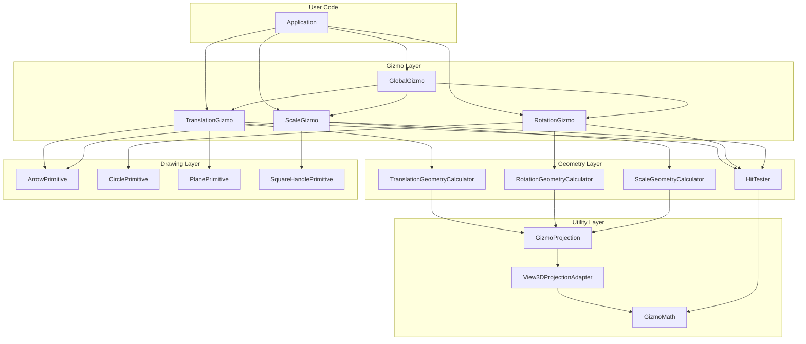

# Code Organization

Structure and organization of the Gizmo3D codebase.

## Directory Structure

```
gizmo-3d/
├── CMakeLists.txt              # Root CMake configuration
├── CMakePresets.json           # Build presets (debug, release, relwithdebinfo)
├── README.md                   # Project overview
├── CLAUDE.md                   # AI assistant guidance
├── run_example.sh              # Example launcher script
│
├── src/                        # QML Module Source
│   ├── CMakeLists.txt          # Module build configuration
│   │
│   ├── TranslationGizmo.qml    # Translation gizmo component
│   ├── RotationGizmo.qml       # Rotation gizmo component
│   ├── ScaleGizmo.qml          # Scale gizmo component
│   ├── GlobalGizmo.qml         # Combined gizmo container
│   │
│   ├── GizmoMath.qml           # Math utilities (singleton)
│   ├── GizmoProjection.qml     # Projection abstraction (singleton)
│   ├── View3DProjectionAdapter.qml  # View3D wrapper (singleton)
│   ├── MockProjection.qml      # Testing mock (singleton)
│   │
│   ├── geometry/               # Geometry calculators (singletons)
│   │   ├── TranslationGeometryCalculator.qml
│   │   ├── RotationGeometryCalculator.qml
│   │   ├── ScaleGeometryCalculator.qml
│   │   └── HitTester.qml
│   │
│   └── drawing/                # Drawing primitives
│       ├── ArrowPrimitive.qml
│       ├── CirclePrimitive.qml
│       ├── PlanePrimitive.qml
│       └── SquareHandlePrimitive.qml
│
├── examples/                   # Example application
│   ├── CMakeLists.txt
│   ├── main.cpp                # Application entry point
│   ├── main.qml                # Main window with 3D scene
│   └── SimpleController.qml    # Reusable controller component
│
├── tests/                      # Test suite
│   ├── CMakeLists.txt          # Test configuration
│   ├── UI_TESTS_README.md      # Test documentation
│   │
│   ├── tst_translationgizmo.cpp
│   ├── tst_rotationgizmo.cpp
│   ├── tst_scalegizmo.cpp
│   ├── tst_translationgizmo_snap.cpp
│   ├── tst_rotationgizmo_snap.cpp
│   │
│   ├── tst_arrowprimitive.cpp
│   ├── tst_circleprimitive.cpp
│   ├── tst_planeprimitive.cpp
│   ├── tst_squarehandleprimitive.cpp
│   │
│   ├── tst_qml_gizmo.cpp       # QML test runner
│   ├── tst_translationgizmo_interaction.qml
│   ├── tst_rotationgizmo_interaction.qml
│   ├── tst_gizmo_controller_integration.qml
│   ├── tst_gizmo_edge_cases.qml
│   ├── tst_gizmo_coordinate_transform.qml
│   ├── tst_gizmo_visual_feedback.qml
│   ├── tst_snap.qml
│   └── tst_rotationgizmo_snap.qml
│
└── doc/                        # Documentation
    ├── index.md                # Documentation hub
    ├── README.md               # Documentation overview
    ├── images/                 # Screenshots and diagrams
    ├── getting-started/
    ├── user-guide/
    ├── api-reference/
    ├── architecture/
    ├── developer-guide/
    ├── troubleshooting/
    └── examples/
```

## Component Layers

### Layer 1: Gizmo Components

User-facing manipulation handles that render and handle interaction.

| Component | Purpose |
|-----------|---------|
| `TranslationGizmo.qml` | 3D position manipulation with axis and plane constraints |
| `RotationGizmo.qml` | 3D rotation manipulation with axis constraints |
| `ScaleGizmo.qml` | 3D scale manipulation with axis and uniform modes |
| `GlobalGizmo.qml` | Container combining all gizmos with mode switching |

**Responsibilities:**
- Canvas rendering of visual handles
- Mouse interaction handling
- Signal emission for Started/Delta/Ended events
- Property management (size, snap, transform mode)

### Layer 2: Geometry Calculators

Pure functions that compute screen-space geometry from 3D inputs.

| Component | Purpose |
|-----------|---------|
| `TranslationGeometryCalculator.qml` | Arrow and plane geometry |
| `RotationGeometryCalculator.qml` | Circle polyline geometry |
| `ScaleGeometryCalculator.qml` | Arrow and handle geometry |
| `HitTester.qml` | Geometric hit detection |

**Responsibilities:**
- Calculate screen-space positions from world coordinates
- Apply screen-space clamping
- Provide geometry for rendering and hit testing

**Design Principle:** No state, no side effects, pure calculations.

### Layer 3: Drawing Primitives

Stateless rendering components for Canvas 2D.

| Component | Purpose |
|-----------|---------|
| `ArrowPrimitive.qml` | Directional arrows with heads or squares |
| `CirclePrimitive.qml` | Circles, arcs, and filled wedges |
| `PlanePrimitive.qml` | Translucent quads |
| `SquareHandlePrimitive.qml` | Square handle markers |

**Responsibilities:**
- Accept Canvas context and geometry
- Render primitives with colors and styles
- No state management

### Layer 4: Utilities

Shared math and projection services.

| Component | Purpose |
|-----------|---------|
| `GizmoMath.qml` | Vector math, intersections, quaternions |
| `GizmoProjection.qml` | Abstract projection interface |
| `View3DProjectionAdapter.qml` | View3D implementation |
| `MockProjection.qml` | Testing mock |

## Singleton Components

The following are QML singletons (one instance per engine):

```cmake
set_source_files_properties(
    GizmoMath.qml
    GizmoProjection.qml
    View3DProjectionAdapter.qml
    MockProjection.qml
    geometry/TranslationGeometryCalculator.qml
    geometry/RotationGeometryCalculator.qml
    geometry/ScaleGeometryCalculator.qml
    geometry/HitTester.qml
    PROPERTIES QT_QML_SINGLETON_TYPE TRUE
)
```

**Usage:**
```qml
// Direct singleton access
var screenPoint = GizmoMath.worldToScreen(view3d, position)
var geometry = TranslationGeometryCalculator.calculateArrowGeometry(params)
```

## QML Module Structure

### Module Definition

```cmake
qt_add_qml_module(gizmo3d
    URI Gizmo3D
    VERSION 0.1
    STATIC
    NO_PLUGIN
    QML_FILES
        TranslationGizmo.qml
        # ... all QML files
    OUTPUT_DIRECTORY ${CMAKE_BINARY_DIR}/src/Gizmo3D
)
```

### Import Path

The module is generated at `${CMAKE_BINARY_DIR}/src/Gizmo3D/`. Applications must set:

```cmake
set(QML_IMPORT_PATH "${CMAKE_BINARY_DIR}/src" CACHE STRING "" FORCE)
```

### Module Usage

```qml
import Gizmo3D 1.0

TranslationGizmo {
    view3d: myView3D
    targetNode: myCube
}
```

## Dependency Graph



## File Naming Conventions

| Pattern | Purpose | Example |
|---------|---------|---------|
| `*Gizmo.qml` | Main gizmo components | `TranslationGizmo.qml` |
| `*GeometryCalculator.qml` | Geometry calculators | `TranslationGeometryCalculator.qml` |
| `*Primitive.qml` | Drawing primitives | `ArrowPrimitive.qml` |
| `tst_*.cpp` | C++ test files | `tst_translationgizmo.cpp` |
| `tst_*.qml` | QML test files | `tst_snap.qml` |

## Adding New Files

### New Gizmo Component

1. Create `src/NewGizmo.qml`
2. Add to `src/CMakeLists.txt` in `QML_FILES`
3. Create corresponding calculator if needed
4. Add tests in `tests/`

### New Geometry Calculator

1. Create `src/geometry/NewGeometryCalculator.qml`
2. Add to `src/CMakeLists.txt` in `QML_FILES`
3. Mark as singleton in `set_source_files_properties`

### New Drawing Primitive

1. Create `src/drawing/NewPrimitive.qml`
2. Add to `src/CMakeLists.txt` in `QML_FILES`

## See Also

- [Building](building.md) - Build system details
- [Testing](testing.md) - Testing guide
- [Adding Gizmos](adding-gizmos.md) - Creating new gizmo types
